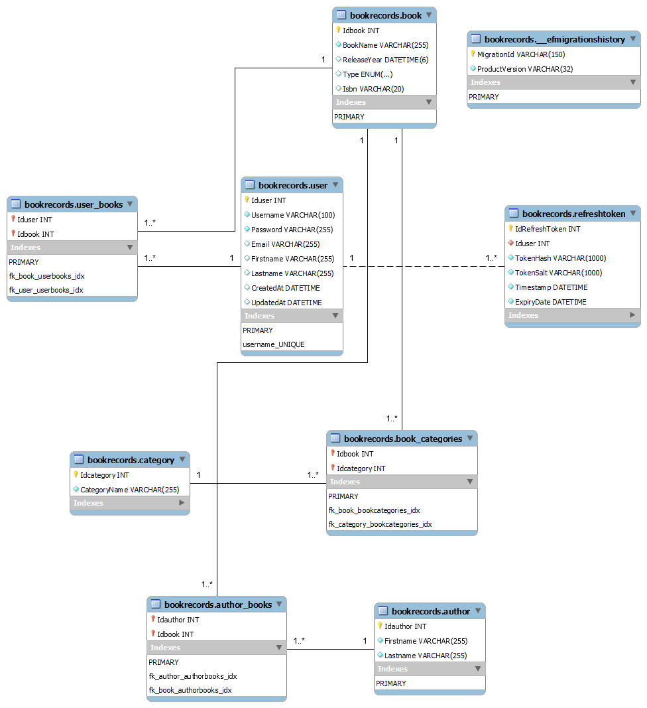

# BookRecords Web API
Inpdependent project for Developer bootcamp 2022. This version requires Docker in order to work.
## Github Repository
<a href="https://github.com/Lepito88/BookRecordsDocker" >BookRecords </a>
# ER-Model

# Configuration
# Endpoints
 ### User
 -

 ### UserBooks
 -

 ### Categories
 -
 ### Books
 -

 ### BookCategories
 -

 ### Author
 -

 ### AuthorBooks
 -